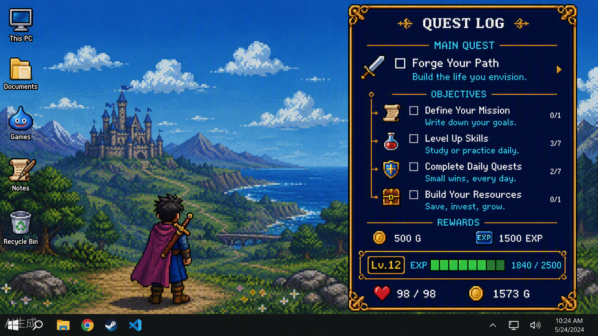
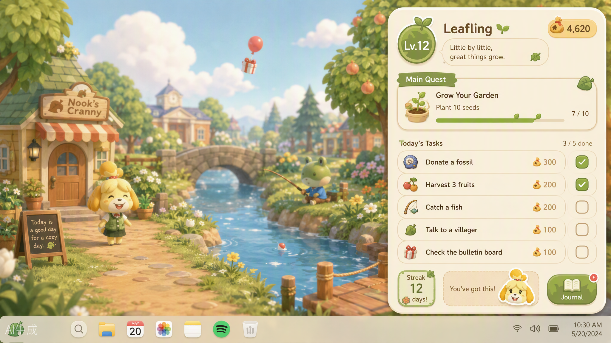
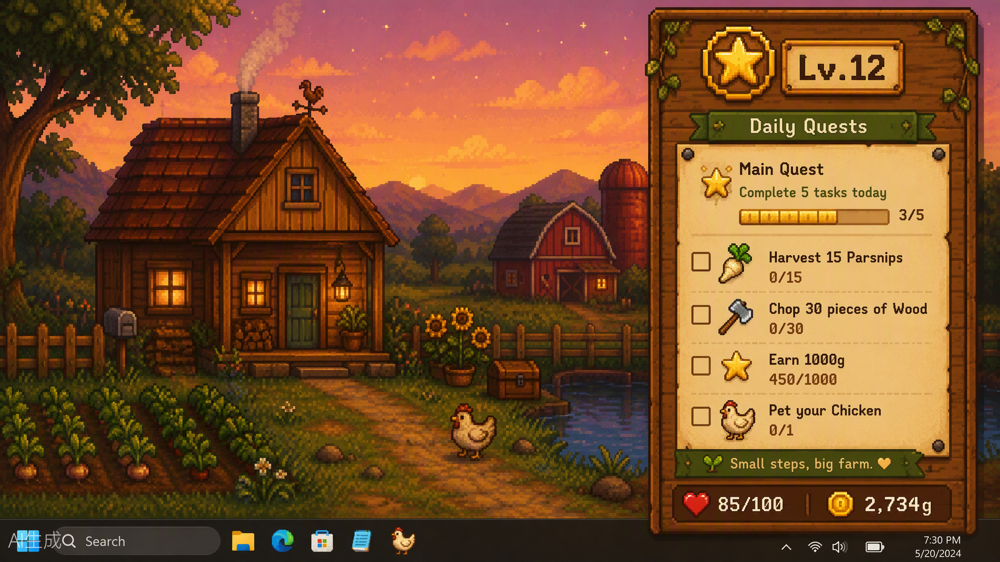

# Xmission

**把日程放在眼前，把目标变成旅程。**

Xmission 是一款面向个人学习与生活的桌面日程备忘录。写下一件要做的事，AI 可以帮你整理成可检查、可修改的任务；导入课表后，可以把课程、日历和每日目标放在同一个地方查看。桌面悬浮栏让今天的安排随时可见，完成目标可获得经验和金币，再用金币兑换自己设定的奖励。

当前版本 **0.67（0.67.0）**，主要支持 Windows 10/11 x64。项目仍在持续开发。

从 [GitHub Releases](https://github.com/zzjj-fdu/xmission/releases) 下载最新版安装包，安装后即可使用手动任务、课表和专注功能；AI 服务由使用者自行配置。

## 功能一览

- **一句话创建任务**：输入自然语言描述，AI 提取任务标题、时间、重要程度等信息，先生成可编辑草稿，确认后再保存。也可以手动创建、编辑、拆分和完成任务。
- **课表导入与识别**：导入 Excel/CSV，或配置兼容的 AI 服务识别课表图片；导入内容会先进入校对步骤。支持学校作息时间模板和课程表查看。
- **日历与计划**：按周查看任务和课程，打开某一天查看日程；配置 AI 后，可以按课表空档生成每周计划建议。
- **桌面悬浮任务栏**：常驻显示任务和进度，可调整大小、位置与透明度；支持收起为悬浮球。
- **目标奖励**：任务、连续记录和专注时长带来经验与金币；在商店管理自定义奖励，也可以使用金币参与可配置奖品的抽奖。
- **专注计时**：全屏专注场景、可设置时长的番茄钟，以及开始、暂停、继续和结束操作。
- **主题风景**：暮色 JRPG、羊皮纸手账、动森小岛、星露谷农场四种主题。风景按晨曦、早上、正午、夕阳、灯火夜晚和凌晨切换，并可选择天气效果；关闭主窗口后重新打开时按当前时间更新时段。
- **备份与导出**：导出今日日报和本地数据备份。

## 界面一览

以下为主题设计展示；开发期间含私人任务与课表的截图不随仓库公开。

| 暮色 JRPG | 羊皮纸手账 |
| --- | --- |
|  |  |
| **动森小岛** | **星露谷农场** |
|  |  |

## 技术栈

- 前端：React、TypeScript、Vite
- 桌面端：Tauri 2、Rust
- 本地数据：SQLite
- AI：用户自选的 OpenAI API 兼容服务

## 主题与动态场景

每个主题都有专属的图标、标签、字体和风景素材。动态效果以静态场景图为底，叠加轻量的云、雨、雪、雾、风和主题粒子；提供减少动态效果选项，并在窗口隐藏时暂停场景更新。

查看[主题美术系统说明](docs/art-system.md)和[六时段风景与天气说明](design/scenes/README.md)。

## 计划中的方向

以下为后续设想，尚未作为完整功能发布：

- AI 宠物提醒与陪伴
- 更丰富的日程规划与旅行青蛙式养成
- 内置小游戏
- 团队任务规划与任务社交
- 连接用户自己的个人 Agent

## 使用 AI 与天气服务

AI 功能需要用户自行配置兼容 OpenAI API 的服务地址、模型和 API Key。API Key 保存在系统凭据存储中；只有使用 AI 功能时，相关任务文字或用户选择的课表图片才会发送到所配置的服务。

联网天气为可选功能。选择城市并启用后，应用会向 Open-Meteo 查询城市天气；城市搜索会向其地理编码服务发送用户输入的城市名。也可以关闭联网天气，手动选择天气效果。天气数据依据 CC BY 4.0 使用，并在设置中标注来源。Open-Meteo 免费 API 仅供非商业用途；商业部署需采用其商业许可或替换为具有相应许可的服务。[服务计划与许可](https://open-meteo.com/en/pricing)

## 开发环境

- Node.js LTS 与 npm
- Rust stable 工具链
- Tauri 2 的平台开发依赖；Windows 需要 WebView2 Runtime

本项目当前以 Windows 桌面应用为主要开发和验证目标。其他平台的打包状态尚未确认。

## 本地运行

```powershell
npm install
npm run tauri dev
```

常用检查与构建：

```powershell
npm run check
npm run build
npm run tauri build
```

`npm run check` 会检查 TypeScript、场景资源和应用加载相关约束。`npm run tauri build` 会生成当前平台的桌面发行构建。

### macOS 测试版

GitHub Actions 已配置 macOS Release 构建，可手动启动或推送 `v0.67-macos.1` 这样的 macOS 标签。构建机生成同时支持 Apple 芯片和 Intel 的 Universal DMG（macOS 11 起），验证两种架构、签名与启动后创建草稿预发布。安装包只取公开项目源码及素材，不包含开发者本地数据。详情见 [macOS 发布说明](docs/releases/0.67-macos.md)。

当前采用 ad-hoc 临时签名，尚未经过 Apple Developer ID 签名和公证，也未完成真实 Mac 的完整交互验收。首次打开时系统可能阻止运行；请确认来源及系统提示。macOS 开机启动暂未提供，API 密钥保存在系统钥匙串。

## 数据与凭据

任务、课程、日历与游戏化进度保存在本机应用数据库中。AI 和联网天气为可选的外部服务；启用后会按上文说明发送相应请求。不要把 API Key 提交到代码仓库、问题单或截图中。

发行安装包只包含程序、数据库结构迁移和公共美术素材，不包含开发者的任务、课程、钱包记录、数据库备份或 API Key。首次启动会在使用者自己的应用数据目录创建数据库；更新安装沿用该使用者本机的数据。仓库排除本地截图与原始生成大图，保留运行所需的压缩风景素材。

## 许可

本仓库采用 **PolyForm Noncommercial License 1.0.0**。允许个人学习、研究、测试和其他符合该许可证定义的非商业用途；未经权利人另行授权，不允许商业使用。详见 [`LICENSE`](LICENSE) 与[许可证原文](https://polyformproject.org/licenses/noncommercial/1.0.0)。

由于禁止商业使用，这是一份**可查看源码的非商业许可项目**，不属于 OSI 定义的开放源代码软件。若你希望商业使用，请先联系权利人取得单独授权。

仓库中的字体、图片及其他第三方素材可能分别适用各自许可；使用或再分发这些素材时，请同时遵守相应目录附带的许可和署名要求。

## 反馈与贡献

欢迎通过 GitHub Issues 提交问题、体验反馈和功能建议。提交代码前请先阅读许可证，并确认贡献内容由你创作或已获合法授权。
